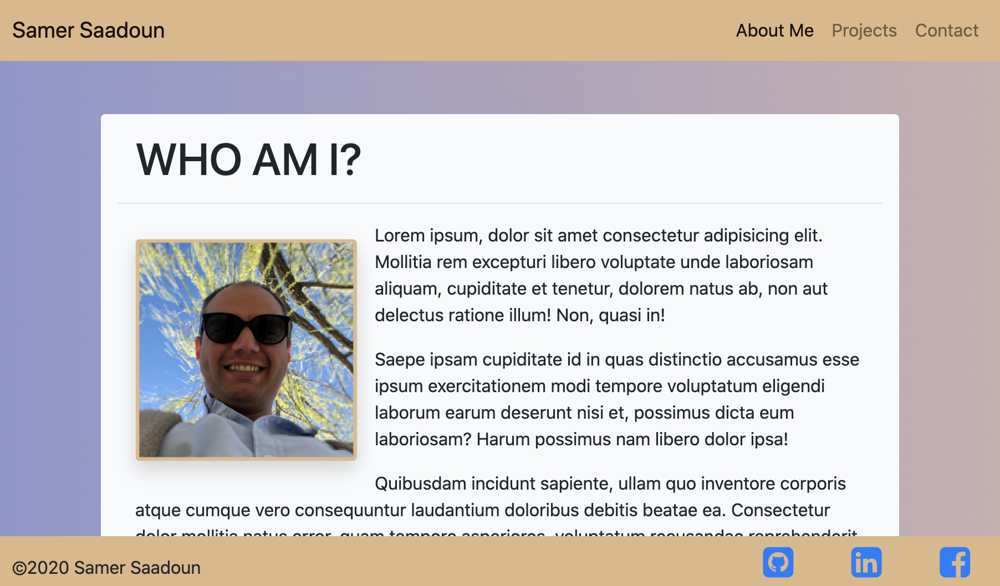

# Personal Portfolio

# Description:
This project was built mainly by using bootstrap Grid system and elements. Minimum css coding is applied too in style.css file.

# Links:
*  [Link to repo](https://github.com/samergain/samers-portfolio)
*  [Link to deployed website](https://samergain.github.io/samers-portfolio/)

# Instructions 
.

# Installation Instructions 
N/A.

# Credits/Thanks 

# License Information 
Bootstrap 4 classes/elements were used.
